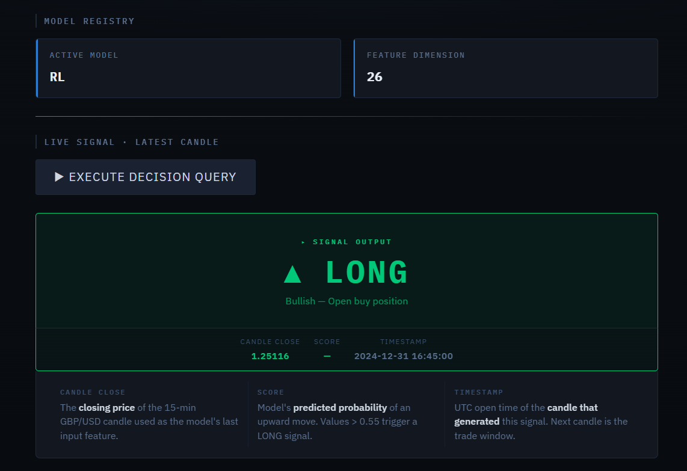

# 📈 GBP/USD Trading Decision System

Machine Learning & Reinforcement Learning based decision system for GBP/USD (M15 timeframe), with FastAPI backend, Streamlit frontend, and Docker deployment.

## Team And Contribution

This project was carried out by a team of two.

My main contribution focused on:
- modeling the trading decision system
- training and evaluating the Machine Learning and Reinforcement Learning approaches
- comparing ML and RL models based on predictive and financial performance
- contributing to the analysis of the final model results


## 🎯 1. Objectif du projet

Développer un système complet de prise de décision de trading sur **GBP/USD (M15)** incluant :

- ✅ Feature engineering avancé
- ✅ Baselines classiques
- ✅ Modèle Machine Learning supervisé
- ✅ Modèle Reinforcement Learning (PPO)
- ✅ Backtesting réaliste avec coûts de transaction
- ✅ API REST (FastAPI)
- ✅ Interface utilisateur (Streamlit)
- ✅ Dockerisation

---

## 📊 2. Données

### Source et traitement

- **Source** : GBP/USD M1
- **Agrégation** : M15 OHLCV
- **Features techniques** : 26 features

### Features principales

```python
# Rendements
return_1

# Moyennes mobiles
ema_20, ema_50

# Indicateurs techniques
rsi_14          # Relative Strength Index
atr_14          # Average True Range
macd            # MACD
macd_signal     # MACD Signal Line
adx_14          # Average Directional Index
# ... autres indicateurs techniques
```

### Split temporel strict

| Période | Usage | Description |
|---------|-------|-------------|
| **2022** | Train | Entraînement des modèles |
| **2023** | Validation | Validation et tuning |
| **2024** | Test final | Évaluation finale |


---

## 🧠 3. Stratégies Implémentées

### 3.1 Baselines

- **Always Long** : Position longue permanente
- **Always Flat** : Aucune position
- **Random** : Positions aléatoires
- **EMA/RSI Rule** : Règles techniques simples

### 3.2 Machine Learning

Modèles supervisés de **classification directionnelle** visant à prédire le signe du rendement futur (hausse ou baisse).

**Objectif:**
Prédire si la prochaine bougie M15 aura un rendement positif ou négatif.

# 🧪 Modèles Testés

Deux modèles de Machine Learning ont été évalués pour la prédiction de la direction du marché GBP/USD.

---

## 📊 Logistic Regression

**Caractéristiques :**

- 🔹 Modèle linéaire probabiliste
- 🔹 Interprétable et transparent
- 🔹 Sert de baseline ML
- 🔹 Sensible aux relations linéaires entre features

**Avantages :**
- Rapidité d'entraînement
- Faible risque d'overfitting
- Coefficients facilement interprétables

**Limites :**
- Assume des relations linéaires
- Performance limitée sur données complexes

---

## 🌲 Random Forest

**Caractéristiques :**

- 🔹 Modèle d'ensemble (arbres de décision)
- 🔹 Capture les non-linéarités
- 🔹 Robuste aux interactions complexes entre features
- 🔹 Meilleure capacité de généralisation

**Avantages :**
- Gère naturellement les interactions entre variables
- Résistant aux outliers
- Pas besoin de scaling des features
- Feature importance intégrée

**Limites :**
- Plus long à entraîner
- Moins interprétable que la régression logistique
- Risque d'overfitting si mal configuré

---
- **Type** : Classification binaire
- **Sortie** : Probabilité de hausse
- **Règles de décision** :
  - P(hausse) ≥ 0.55 → **LONG**
  - P(hausse) < 0.45 → **SHORT**
  - Sinon → **FLAT**


---

## 📈 Résultats Comparatifs (2023 - Validation)

| Modèle | Accuracy | Sharpe | Max DD | Profit Factor |
|--------|----------|--------|--------|---------------|
| **Logistic Regression** | TBD | TBD | TBD | TBD |
| **Random Forest** | TBD | TBD | TBD | TBD |

> ⚠️ **Note** : Après validation sur 2023, le meilleur modèle a été sélectionné pour le test final 2024.

---

**Modèle sauvegardé dans :**
```
models/V1/
```

### 3.3 Reinforcement Learning (PPO)

**Configuration :**

- **Actions** : {-1, 0, +1} (SHORT, FLAT, LONG)
- **Reward function** :

```
r_t = log_return_{t+1} × position_t - cost × |Δposition|
```

- **Algorithme** : Proximal Policy Optimization (PPO)
- **Environnement** : Custom gym environment

**Modèle sauvegardé dans :**
```
models/rl_v1/
```

---

## 📈 4. Résultats 2024 (Test Final)

### 🔹 RL (PPO)

```json
{
  "final_equity": 3.319,
  "max_drawdown": -0.0095,
  "sharpe": 22.71,
  "profit_factor": 1.60,
  "n_trades": 7511
}
```

**Interprétation :**

- 🔵 Capital multiplié par **~3.3**
- 🔵 Drawdown très faible (**~0.95%**)
- 🔵 Sharpe très élevé (**22.71**)
- 🔵 Profit factor > 1 (stratégie profitable)
- 🔵 Trading actif (**7511 trades**)

### 🔹 ML (2024)

**Fichiers générés :**

```
reports/ml_2024_stats.json
reports/ml_2024_finance.json
```

**Métriques disponibles :**

- Accuracy
- Precision / Recall
- Sharpe Ratio
- Max Drawdown
- Profit Factor

### 🔹 Comparaison Finale

**Fichier généré :**

```
reports/final_comparison_2024.csv
```

**Comparaison entre :**

- Baselines
- Machine Learning
- Reinforcement Learning

---

## 🖥 5. Architecture du Projet

```
┌─────────────────────┐
│   Streamlit UI      │
│   (Port 8501)       │
└──────────┬──────────┘
           │
           ▼
┌─────────────────────┐
│   FastAPI Backend   │
│   (Port 8000)       │
└──────────┬──────────┘
           │
           ▼
┌─────────────────────┐
│   ML / RL Models    │
│   (models/)         │
└──────────┬──────────┘
           │
           ▼
┌─────────────────────┐
│  Parquet Features   │
│  (data/)            │
└─────────────────────┘
```

### Structure des fichiers

```
                    ┌───────────────────────────────────────────┐
                    │        SYSTEME-DE-DECISION-TRADING         │
                    └───────────────────────────────────────────┘

 ┌──────────────────────────┐
 │        DATA LAYER         │
 └──────────────────────────┘
   data/raw/ (M1 CSV)                 data/processed/ (PARQUET features)
           │                                  ├─ m15_2022_features.parquet
           │                                  ├─ m15_2023_features.parquet
           │                                  └─ m15_2024_features.parquet
           │
           ▼
 ┌──────────────────────────┐
 │      FEATURE ENGINEERING  │
 └──────────────────────────┘
   src/data_import.py   src/m15_agg.py   src/clean_m15.py   src/features.py
                           │
                           ▼
 ┌──────────────────────────────────────────────────────────────┐
 │                   STRATEGIES + BACKTEST CORE                 │
 └──────────────────────────────────────────────────────────────┘
   src/strategies/
     ├─ baselines.py       → always_long / always_flat / random / ema_rsi_rule
     ├─ ml_train.py        → train ML (2022) + validate (2023) + save models/V1
     ├─ ml_infer.py        → load ML + predict
     ├─ rl_env.py          → Gym env (state=features, action=-1/0/+1, reward)
     ├─ rl_train.py        → train PPO RL (2022) + save models/rl_v1
     ├─ backtest.py        → backtest engine + transaction cost
     └─ metrics.py         → Sharpe / MaxDD / ProfitFactor / etc.

                           │
                           ▼
 ┌──────────────────────────┐
 │    EVALUATION & REPORTS   │
 └──────────────────────────┘
   src/evaluation/ (eval_pipeline.py, plots.py)
   scripts/ (run_*.py)
     ├─ run_baselines_2024.py
     ├─ run_train_ml.py / run_eval_2024.py
     ├─ run_train_rl.py / run_eval_rl_2024.py
     ├─ run_plot_equity_2024_all.py
     └─ run_final_comparison_2024.py
           │
           ▼
   reports/
     ├─ baselines_2024.csv
     ├─ ml_2024_stats.json / ml_2024_finance.json
     ├─ rl_2024_finance.json
     ├─ equity_2024_baselines_vs_ml_vs_rl.png
     └─ final_comparison_2024.csv

                           │
                           ▼
 ┌──────────────────────────────────────────────────────────────┐
 │                      MODEL ARTIFACTS                         │
 └──────────────────────────────────────────────────────────────┘
   models/
     ├─ V1/ (ML)      → model.joblib + metadata.json
     ├─ rl_v1/ (RL)   → ppo_model.zip + metadata.json
     └─ active_model.json   (choix du modèle servi par l'API)

                           │
                           ▼
 ┌──────────────────────────────────────────────────────────────┐
 │                    DEPLOYMENT (PRODUCTION)                   │
 └──────────────────────────────────────────────────────────────┘

   ┌───────────────────────────────┐        HTTP         ┌──────────────────────────┐
   │  Streamlit UI (port 8501)     │  ───────────────▶   │   FastAPI API (port 8000)│
   │  streamlit_app/app.py         │                     │   api/main.py            │
   │  "Get latest decision"        │                     │   /decision/latest       │
   └───────────────────────────────┘                     │   /predict (debug)       │
                                                         │   /health, /model_version│
                                                         └──────────────────────────┘
                                                                      │
                                                                      ▼
                                                         Reads parquet + loads active model

```

---

## 🚀 6. Exécution Complète du Projet

### 6.1 Installation

```bash
# Créer l'environnement virtuel
python -m venv venv

# Activer l'environnement (Windows)
.\venv\Scripts\Activate.ps1

# Activer l'environnement (Mac/Linux)
source venv/bin/activate

# Installer les dépendances
pip install -r requirements.txt
```

### 6.2 Génération des features

```bash
python -m scripts.run_build_features_all_years
```

### 6.3 Machine Learning

```bash
# Entraînement
python -m scripts.run_train_ml

# Évaluation 2024
python -m scripts.run_eval_2024
```

### 6.4 Reinforcement Learning

```bash
# Entraînement
python -m scripts.run_train_rl

# Évaluation 2024
python -m scripts.run_eval_rl_2024
```

### 6.5 Choisir le modèle actif

```bash
python .\scripts\set_active_model.py
```

---

## 🌐 7. API (FastAPI)

### Lancer l'API

```bash
uvicorn api.main:app --host 127.0.0.1 --port 8000
```

### Documentation Swagger

```
http://127.0.0.1:8000/docs
```

### Endpoints disponibles

| Méthode | Endpoint | Description |
|---------|----------|-------------|
| `GET` | `/health` | Health check de l'API |
| `GET` | `/model_version` | Version du modèle actif |
| `GET` | `/decision/latest` | Dernière décision de trading |
| `POST` | `/predict` | Prédiction sur nouvelles données |

### Exemple d'utilisation

```python
import requests

# Health check
response = requests.get("http://127.0.0.1:8000/health")
print(response.json())

# Obtenir la dernière décision
response = requests.get("http://127.0.0.1:8000/decision/latest")
print(response.json())
# {"decision": "LONG", "confidence": 0.67, "timestamp": "2024-01-15T10:30:00"}
```

---

## 🎨 8. Interface Streamlit

### Lancer l'interface

```bash
streamlit run streamlit_app/app.py
```

### Accès

```
http://localhost:8501
```

### Fonctionnalités

- 📊 Bouton **"Get latest decision"**
- 🎯 Affichage de la décision : **LONG** / **SHORT** / **FLAT**
- 🔄 Mode production (features calculées automatiquement)
- 📈 Visualisation des métriques de performance
- 🕒 Historique des décisions

---

## 🐳 9. Dockerisation

### Lancer avec Docker Compose

```bash
docker compose up --build
```

### Accès aux services

| Service | URL | Description |
|---------|-----|-------------|
| **API** | http://localhost:8000 | FastAPI backend |
| **Streamlit** | http://localhost:8501 | Interface utilisateur |

### Architecture micro-services

```yaml
services:
  api:
    build: .
    ports:
      - "8000:8000"
    environment:
      - MODEL_PATH=/app/models
    
  streamlit:
    build: .
    ports:
      - "8501:8501"
    depends_on:
      - api
```

### Commandes Docker utiles

```bash
# Arrêter les services
docker compose down

# Voir les logs
docker compose logs -f

# Rebuild sans cache
docker compose build --no-cache

```

---

## 🔐 10. Sécurité & Production

### Bonnes pratiques implémentées

- ✅ **Chemins locaux non exposés** : Tous les chemins sensibles sont en variables d'environnement
- ✅ **Modèle actif sélectionné** via `active_model.json`
- ✅ **Pas de retrain via API** : Training offline uniquement pour éviter les abus


## 📊 Métriques de Performance

### ML Model (2024)

| Métrique | Valeur |
|----------|--------|
| Accuracy | *** |
| Precision | *** |
| Recall | *** |
| Sharpe Ratio | *** |
| Max Drawdown | *** |

### RL Model (2024)

| Métrique | Valeur |
|----------|--------|
| Final Equity | *** |
| Max Drawdown | *** |
| Sharpe Ratio | *** |
| Profit Factor | *** |
| Number of Trades | *** |

---

## 🧩 Technologies

### Backend
- **FastAPI** — Modern Python web framework
- **Pydantic** — Data validation
- **Uvicorn** — ASGI server

### Machine Learning
- **Scikit-Learn** — ML algorithms
- **Stable-Baselines3** — RL (PPO)
- **Gymnasium** — RL environment

### Data Processing
- **Pandas** — Data manipulation
- **NumPy** — Numerical computing
- **Parquet** — Efficient data storage

### Frontend
- **Streamlit** — Interactive UI
- **Plotly** — Visualizations

### DevOps
- **Docker** — Containerization
- **Docker Compose** — Multi-container orchestration

---

## 🎓 Workflow Complet

```
1. Data Collection (M1 OHLCV)
         ↓
2. Feature Engineering (26 features)
         ↓
3. Train ML Model (2022)
         ↓
4. Train RL Model (PPO)
         ↓
5. Validate (2023)
         ↓
6. Test Final (2024)
         ↓
7. Deploy (Docker)
         ↓
8. Production (API + Streamlit)
```

## 🚀 Quick Start

```bash
# Clone the repository
git clone https://github.com/eyabensalem/Systeme-de-decision-trading.git
cd Systeme-de-decision-trading

# Docker deployment (fastest)
docker compose up --build

# Access services
# API: http://localhost:8000/docs
# UI: http://localhost:8501
```
## App Interface


